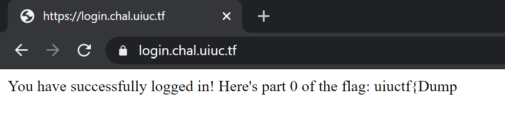

# UIUCTF 2020 login_page Writeup/Walkthrough

Category: Web  
Points: 200

## [Description](https://ctftime.org/task/12418)
```
I came across this login page running sqlite and was told there was a flag behind it. Can you find it?

https://login.chal.uiuc.tf

Author: Husnain
```

This challenge ended up being a combination of sql injection and hash cracking. Picking up hashcat again after several years was fun, especially now that I have a nice GPU to run it on :)

## Prerequisites
This writeup aims to be a good introduction to both SQL injection and hash cracking, but I do assume you have a basic knowledge of SQL and know what MD5 is. If you've done any backend/fullstack web dev before you should be fine.

## Intro

Navigating to the link in the description presents us with a barebones login form

  
_It might take your eyes a few minutes to adjust to the blinding white light. Y u no darkmode SIGPWNY?_

Trying some basic defaults doesn't get us anywhere.

  
_admin/hunter2_

Let's take a look at the `Search for users` link.

  
_Even more barebones than the login form!_

Taking a look at the source shows both pages to be dumb forms, all the interesting stuff is happening on the server. Combined with the fairly blatant hint about sqlite, SQL injection looks to be the way to go.

A SQL injection vulnerability allows an attacker to run SQL statements directly against the application's database. [Here's](https://owasp.org/www-community/attacks/SQL_Injection) a nice overview. There are automated tools that can help find and exploit these automatically ([sqlmap](http://sqlmap.org/) for example), but that's boring. It's much more interesting to do this ourselves (and a good introduction to SQL injections), so let's get too it!

## SQL Injection (Listing Users)

Let's start with the user search page, since it's simpler (only one field). Playing around with a couple of searches reveals something interesting:

  
_Hacker Isabelle's [favorite](https://www.youtube.com/channel/UCnL8vVmpKY8ZmfSwoikavHQ/about) letter_

Notice how most of the names don't actually start with `a`, they just contain it somewhere. This means the query on the server is probably contains a `WHERE` clause with a `LIKE` operator along the lines of
```sql
... WHERE username LIKE "%[SEARCH]%";
```
(the `[SEARCH]` part is where our input goes) If we input a `%` into the search box, we'll end up with the below query with all wildcards, matching all the users:
```sql
... WHERE username LIKE "%%%"
```

  
_Hello everyone, nice to meet you all_

If we try some of these names on the login page, we get some new information:

  
_Hint: look at the hints_

Here's a table with all the users and their password hints:

|Name|Hint|Notes|
|---|---|---|
|alice|My phone number (format: 000-000-0000)||
|bob|My favorite 12 digit number (md5 hashed for extra security) [starts with a 10]||
|carl|My favorite Greek God + My least favorite US state (no spaces)||
|dania|الحيوان المفضل لدي (6 أحرف عربية فقط)|Arabic, Translates to "My favorite animal (6 Arabic characters only)"|
|noob||No hint|

The hints are nice, but not enough info for us to start guessing passwords (except maybe carl's), so we'll put these aside for now and return to the search page.

## SQL Injection (Arbitrary Queries)

Some might quibble about calling what we did in the above section SQL Injection, but what we're doing in this section definitely is!

Our current goal is to find out more information about the structure of the database, since there's a good chance that password information is stored in the same location as other user data. We'll need to make some more complicated queries to do that. Unfortunately we're still stuck inside the `LIKE` operator. Let's see if we can get out of that.

Taking another look at what we know of the query currently
```sql
... WHERE username LIKE "%[SEARCH]%";
```
If we play around a bit more, we might input a `"` into the search box. When we run that search, we get an error. This means the server is probably constructing the query like this:
```python
query = '... WHERE username LIKE "%' + search + '%";'
```
When `search = "` (one double quote), that causes the final query to look like this 
```sql
... WHERE username LIKE "%"%";
```
We managed to close out the `LIKE` query, but now there's this extra `%";` at the end of the query, causing issues. So let's comment it out (we also need the semicolon, to end the query). The string we need to input into the search box is `"; --`, giving
```sql
... WHERE username LIKE "%"; --%";
```
This query will also list all of the users (like in the section above), but now we have a lot more control over the resulting query. Unfortunately, all of the control we have is at the end, in the `WHERE` clause. How are we going to run our own queries? `UNION` to the rescue!

The `UNION` operator isn't commonly used, so don't feel bad if you've never heard of it before. Essentially, it lets you combine the results of two queries into one. The catch is both queries need to have the same column names, and we don't know what ours need to be!

Thankfully, they aren't too hard to figure out. A quick glance at the column headings on the user lets us guess that `name` and `bio` are the names of the columns. We can test this by using `" UNION SELECT "one" as name, "two" as bio; --` as the search input.
That leads to a query that looks like
```sql
... WHERE username LIKE "%" UNION SELECT "one" as name, "two" as bio; --%";
```

  
_One pwn, Two pwn, Red pwn, Blue pwn_

## SQL Injection (Dumping Hashes)

Now that we can execute arbitrary sql, let's see about getting some more information about the application's database. We know from the challenge description that it's using sqlite, and a quick google gives us a query we can use to list all the tables and their schemas (modified slightly to fit our column names):
```sql
SELECT name, sql AS "bio" FROM sqlite_master WHERE type='table'
```
This query can be injected in exactly the same way as the query in the above section, and when run will output

  
_INSERT joke INTO jokes_

So it looks like there's only one table, named `users`. Lets pull out and format the schema so it's easier to read.
```sql
CREATE TABLE users (
    username text primary key not null, 
    password_hash text not null, 
    hint text not null, 
    bio text not null
)
```
Aha! `password_hash` looks interesting, doesn't it? Let's write a query that will dump those (notice we need to rename `username` to `name` as well):
```sql
SELECT username AS name, password_hash AS bio FROM users
```
Repeating the process for this query, we get the search input we need to dump every user's password hash:
```
" UNION SELECT username AS name, password_hash AS bio FROM users; --
```


|Name|Password Hash|
|---|---|
|alice|530bd2d24bff2d77276c4117dc1fc719|
|bob|4106716ae604fba94f1c05318f87e063|
|carl|661ded81b6b99758643f19517a468331|
|dania|58970d579d25f7288599fcd709b3ded3|
|noob|8553127fedf5daacc26f3b677b58a856|

**Exercise for the reader:** Can you construct an input to the searchbox that would return only the user's hashes, and not their bios?

## Hash Cracking (Noob - Google)

So now we have all the user's hashes, but that's only half of the problem. We need the actual user's passwords in order to login. These are MD5 hashes (We can tell because hash is a 32 character hex string. That's a pretty strong indicator that it's an MD5).

MD5 is a bad hashing algorithm in general, and it's an even worse password hashing algorithm. That hasn't stopped people from using it though, and in fact it's common enough that it's possible to crack some hashes with google:

  
_The coveted single result google search_

  
_I guess SoccerMom1 through SoccerMom2006 were all taken_

We now have noob's password (`SoccerMom2007`), and can log in to their account to get a part of the flag.


_What a noob move_

That gives us the first part, but it looks like we'll need to login in to everyone's account to get the full flag. Unfortunately, the google trick only works for noob's password. We'll have to be a little more clever for the others.

## Hash Cracking (Carl - Python)

Thankfully, we have some hints. We found them back while we were SQL injecting:

|Name|Hint|Notes|
|---|---|---|
|alice|My phone number (format: 000-000-0000)||
|bob|My favorite 12 digit number (md5 hashed for extra security) [starts with a 10]||
|carl|My favorite Greek God + My least favorite US state (no spaces)||
|dania|الحيوان المفضل لدي (6 أحرف عربية فقط)|Arabic, Translates to "My favorite animal (6 Arabic characters only)"|
|noob||No hint|

Let's start with carl, his seems the least complex. There are 50 US states, and according to [Wikipedia] there are 14 greek gods, but a couple of them have more than one name, bringing the total number of names to check to 16. That's a total of `16 * 50 = 800` password candidates to check, which we can run through with a quick script I used python (Full script with all state names and greek gods is in the repo):
```python
import hashlib
import sys

target = "661ded81b6b99758643f19517a468331"

states = ["Alabama", "Alaska" ... "Wyoming"]
greek_gods = ["Aphrodite", "Apollo" ... "Zeus"]

def hash(password):
    return hashlib.md5(password.encode()).hexdigest()

for god in greek_gods:
    for state in states:
        password = god + state
        if hash(password) == target:
            print(password)
            exit()
```
All the script does is combine every pair of greek god and US state, hashing them and comparing the result to carl's password hash, the `target`. Running the above will output `DionysusDelaware`, which we can use to login to carl's account to get another part of the flag:


_[Carl?!?! What did you do?](https://www.youtube.com/watch?v=kZUPCB9533Y)_

## Hash Cracking (Alice - Hashcat)

Let's move on to alice. Her hint is `My phone number (format: 000-000-0000)`. In order to brute force this, we'll need to try all the phone numbers between 000-000-0000 and 999-999-9999, for a total of 10,000,000,000 possible combinations. We could write another script to run through all of these, but it would take much longer (on the order of hours, probably). Thankfully, there's a better way.

Enter [hashcat](https://hashcat.net/hashcat/). Hashcat is a specially designed hash cracker, and is a lot faster than a python script. In fact, it claims to be the fastest password cracker in the world. The main reason it's so fast is that hashcat can run on the GPU meaning it can try potentially thousands of passwords candidates at once. Let's see how we can use this power to crack alice's password.
```
> hashcat.exe 530bd2d24bff2d77276c4117dc1fc719 -a 3 ?d?d?d-?d?d?d-?d?d?d?d
               ^                                ^    ^
               |                                |    |
              (1)                              (2)  (3)
```
Let's go over this step by step
1. `530bd2d24bff2d77276c4117dc1fc719`: The hash we want to crack. Hashcat is smart enough to figure out this is an MD5 hash on it's own
2. `-a 3`: This tells hashcat the attack mode we want to use. This is where we tell hashcat how to generate password candidates. In this case, since alice's hint gives us a pattern, we're using a [mask attack](https://hashcat.net/wiki/doku.php?id=mask_attack) (mode 3). See [here](https://hashcat.net/wiki/) for a list of other attack modes.
3. `?d?d?d-?d?d?d-?d?d?d?d`: This is the mask that the mask attack mode uses. Wildcard characters are represented by a question mark, followed a letter indicating what characters can go in that spot. `?d` represents any one digit, 0-9. So this mask tells hashcat to generate password candidates that look like phone numbers. [This](https://hashcat.net/wiki/doku.php?id=mask_attack) page has a list of all the built in wildcard types.

We can run this, and assuming everything is set up correctly with hashcat, we get the following (in between a bunch of other output):
```
530bd2d24bff2d77276c4117dc1fc719:704-186-9744
```
We can verify by logging into alice's account with the password `704-186-9744` and retrieving the next part of the flag.


_Down the rabbit hole we go_

## Hash Cracking (Bob - Hashcat Modes)

Bob's hint is `My favorite 12 digit number (md5 hashed for extra security) [starts with a 10]`.

Bob is trying to be sneaky here. He remembers his favorite number, but doesn't use it directly as the password. Instead he hashes it first, and uses that as the password. That means the password hash we have for him has actually been through two layers of MD5!

Thankfully, that's no problem for hashcat:
```
> hashcat.exe 4106716ae604fba94f1c05318f87e063 -m 2600 -a 3 10?d?d?d?d?d?d?d?d?d?d
                                                ^            ^
                                                |            |
                                               (1)          (2)
```
1. `-m 2600`: This tells hashcat the hash mode to use. Previously we had let it default to MD5, but here set it mode 2600, which tells hashcat to use MD5 twice. A full list of available hash modes is [here](https://hashcat.net/wiki/doku.php?id=hashcat)
2. `10?d?d?d?d?d?d?d?d?d?d`: We need to update the mask to match the hint we have for bob.

After running, we get the following output:
```
4106716ae604fba94f1c05318f87e063:102420484096
```
If we try `102420484096` directly however, it doesn't work. Bob's password is actually the hash of this string, which we can compute in a couple of ways. I like python:
```
> python -c "import hashlib; print(hashlib.md5(b'102420484096').hexdigest())"
5809be03c7cc31cdb12237d0bd718898
```
Logging in to bob with `5809be03c7cc31cdb12237d0bd718898` as the password gives us another part of the flag.


_How many burger's do you think he has?_

## Hash Cracking (Dania - Arabic)

Were on the home stretch now, only one more hash to crack. Unfortunately, this is a tough one. As a reminder, Dania's hint is in Arabic which translates to `My favorite animal (6 Arabic characters only)`

Unfortunately, hashcat doesn't have any direct built in support for Arabic characters. Thankfully, a quick google shows it is flexible enough to allow us to do it ourselves. The trick is that each Arabic character (when UTF-8 encoded) is actually two bytes long. We can use the mask attack with some custom character sets to tell hashcat to only construct valid Arabic characters. See [this](https://blog.bitcrack.net/2013/09/cracking-hashes-with-other-language.html) page for more information on how this works.
```
> hashcat.exe 58970d579d25f7288599fcd709b3ded3 --hex-charset -1 d8d9dadb -2 808182838485868788898a8b8c8d8e8f909192939495969798999a9b9c9d9e9fa0a1a2a3a4a5a6a7a8a9aaabacadaeafb0b1b2b3b4b5b6b7b8b9babbbcbdbebf -a 3 ?1?2?1?2?1?2?1?2?1?2?1?2 -o dania.out
```
Man, this one looks a lot scarier! Let's break it down:
1. `--hex-charset`: Haschat lets you enter custom character sets to use in the mask pattern. This switch tells hashcat that the custom character sets you give it are actually encoded as a hex string, and need to be decoded first.
2. `-1 d8d9dadb`: Custom character set representing all possible values for the first byte in a UTF-8 encoded Arabic character
3. `-2 80818...`: Custom character set representing all possible values for the second byte in a UTF-8 encoded Arabic character
4. `?1?2?1?2?1?2?1?2?1?2?1?2`: The mask for hashcat to use. `?1` means a character from the first custom character set, `?2` the second. So each combination of `?1?2` represents a single Arabic character.
5. `-o dania.out`: This tells hashcat to output the result to a file, instead of to the console. Your milage may vary, but my terminal has issues displaying anything that isn't straight ASCII. Writing the result directly to a file gave me less headaches when trying to copy it to the password field.

This one runs for longer than the previous hashes (about 20 minutes on my 1080), but once it's done you can open `dania.out` in your favorite unicode enabled text editor, copy the password (`طاووسة`) out and use it to log in and get the final part of the flag:

  
_I've run out of lame jokes_

Concatenating all of the flag parts together gives us the full flag, which we can submit for points.
```
uiuctf{Dump_4nd_unh45h_637_d4t_c45h}
```
_Fin._