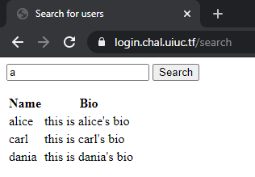
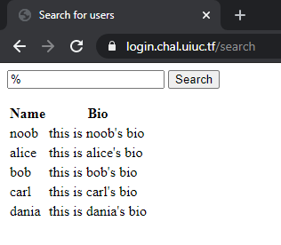
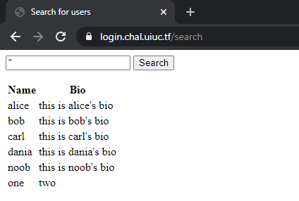

# UIUCTF 2020 login_page

Category: Web  
Points: 200

## [Description](https://ctftime.org/task/12418)
```
I came across this login page running sqlite and was told there was a flag behind it. Can you find it?

https://login.chal.uiuc.tf

Author: Husnain
```

This challenge ended up being a combination of sql injection and hash cracking. Picking up hashcat again after several years was fun, especially now that I have a nice GPU to run it on :)

## Preqresites
This writeup aims to be a good introduction to both SQL injection and hash cracking, but I do assume you have a basic knowledge of SQL and know what MD5 is. If you've done any backend/fullstack web dev before you should be fine.

## Intro
---

Navigating to the link in the description presents us with a barebones login form

  
_It might take your eyes a few minutes to adjust to the blinding white light. y u no darkmode?_

Trying some basic defaults doesn't get us anywhere.

  
_admin/hunter2_

Let's take a look at the `Search for users` link.

  
_Even more barebones than the login form!_

Taking a look at the source shows both pages to be dumb forms, all the interesting stuff is happening on the server. Combined with the fairly blatant hint about sqlite, SQL injection looks to be the way to go.

A SQL injection vulnerability allows an attacker to run SQL statements directly against the application's database. [Here's](https://owasp.org/www-community/attacks/SQL_Injection) a nice overview. There are automated tools that can help find and exploit these automatically ([sqlmap](http://sqlmap.org/) for example), but that's boring. It's much more interesting to do this ourselves (and a good introduction to SQL injections), so let's get too it!

## SQL Injection (Listing Users)
---

Let's start with the user search page, since it's simpler (only one field). Playing around with a couple of searches reveals something interesting:

  
_Hacker Isabelle's [favorite](https://www.youtube.com/channel/UCnL8vVmpKY8ZmfSwoikavHQ/about) letter_

Notice how most of the names don't actually start with `a`, they just contain it somewhere. This means the query on the server is probably contains a `WHERE` clause with a `LIKE` operator along the lines of
```sql
... WHERE username LIKE "%[SEARCH]%";
```
(the `[SEARCH]` part is where our input goes) If we input a `%` into the search box, we'll end up with the below query, matching all the users:
```sql
... WHERE username LIKE "%%%"
```
  
_Hello everyone, nice to meet you all_

If we try some of these names on the login page, we get some new information:

  
_Hint: look at the hints_

Here's a table with all the users and their password hints:

|Name|Hint|Notes|
|---|---|---|
|alice|My phone number (format: 000-000-0000)||
|bob|My favorite 12 digit number (md5 hashed for extra security) [starts with a 10]||
|carl|My favorite Greek God + My least favorite US state (no spaces)||
|dania|الحيوان المفضل لدي (6 أحرف عربية فقط)|Arabic, Translates to "My favorite animal (6 Arabic characters only)"|
|noob||No hint|

The hints are nice, but not enough info for us to start guessing passwords (except maybe carl's), so we'll put these aside for now and return to the search page.

## SQL Injection (Arbitraty Queries)
---
Some might quibble about calling what we did in the above section SQL Injection, but what we're doing in this section definitely is!

Our current goal is to find out more information about the strucute of the database, since there's a good chance that password information is stored in the same location as other user data. We'll need to make some more complicated queries to do that. Unfortunately we're still stuck inside the `LIKE` operator. Let's see if we can get out of that.

Taking another look at what we know of the query currently
```sql
... WHERE username LIKE "%[SEARCH]%";
```
If we play around a bit more, we might input a `"` into the search box. When we run that search, we get an error. This means the server is probably constructing the query like this:
```python
query = '... WHERE username LIKE "%' + search + '%";'
```
When `search = "` (one double quote), that causes the final query to look like this 
```sql
... WHERE username LIKE "%"%";
```
We managed to close out the `LIKE` query, but now their's this extra `%";` at the end of the query, causing issues. So let's comment it out (we also need the semicolon, to end the query). The string we need to input into the search box is `"; --`, giving
```sql
... WHERE username LIKE "%"; --%";
```
This query will also list all of the uesrs (like in the section above), but now we have a lot more control over the resulting query. Unfortunately, all of the control we have is at the end, in the `WHERE` clause. How are we going to run our own queries? `UNION` to the rescue!

The `UNION` operator isn't commonly used, so don't feel bad if you've never heard of it before. Essentialy, it lets you combine the results of two queries into one. The catch is both queries need to have the same column names, and we don't know what ours need to be!

Thankfully, they aren't too hard to figure out. A quick glance at the column headings on the user lets us guess that `name` and `bio` are the names of the columns. We can test this by using `" UNION SELECT "one" as name, "two" as bio; --` as the search input.
That leads to a query that looks like
```sql
... WHERE username LIKE "%" UNION SELECT "one" as name, "two" as bio; --%";
```
  
_One pwn, Two pwn, Red pwn, Blue pwn_

## SQL Injection (Dumping Hashes)
---
Now that we can execute arbitraty sql, let's see about getting some more information about the application's database. We know from the challenge description that it's using sqlite, and a quick google gives us a query we can use to list all the tables and their schemas (modified slightly to fit our column names):
```sql
SELECT name, sql AS "bio" FROM sqlite_master WHERE type='table'
```
This query can be injected in exactly the same way as the query in the above section, and when run will output
  
_INSERT joke INTO jokes_

So it looks like there's only one table, named `users`. Lets pull out and format the schema so it's easier to read.
```sql
CREATE TABLE users (
    username text primary key not null, 
    password_hash text not null, 
    hint text not null, 
    bio text not null
)
```
Aha! `password_hash` looks interesting, doesn't it? Let's write a query that will dump those (notice we need to rename `username` to `name` as well):
```sql
SELECT username AS name, password_hash AS bio FROM users
```
Repeating the process for this query, we get the search input we need to dump every user's password hash:
```
" UNION SELECT username AS name, password_hash AS bio FROM users; --
```


|Name|Password Hash|
|---|---|
alice|530bd2d24bff2d77276c4117dc1fc719
bob|4106716ae604fba94f1c05318f87e063
carl|661ded81b6b99758643f19517a468331
dania|58970d579d25f7288599fcd709b3ded3
noob|8553127fedf5daacc26f3b677b58a856

## Hash Cracking (Intro)