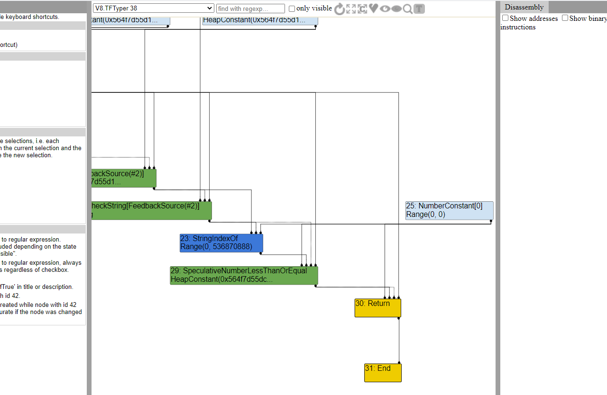
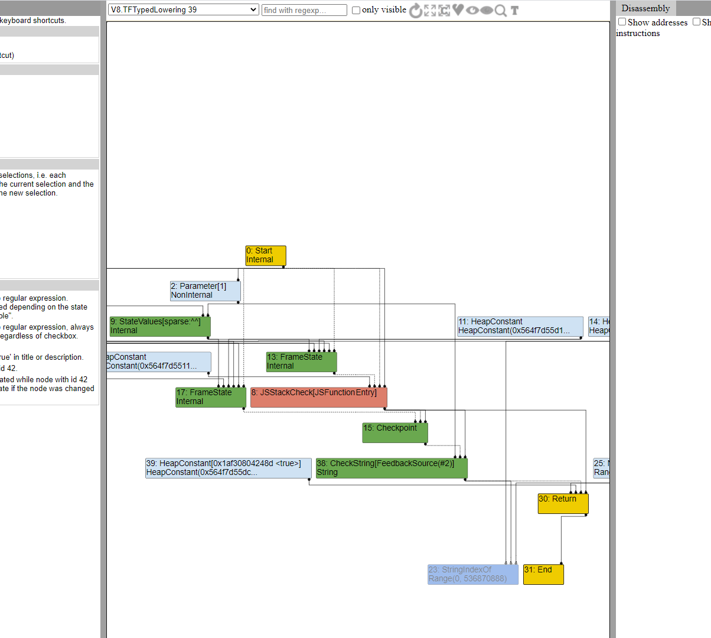

# Introduction to v8 Exploitation: UIUCTF 2021 `shouldvehadav8`

I spent some time this weekend playing in [UIUCTF 2021](https://uiuc.tf/), which was a blast. I took on my second-ever v8 pwn challenge, `shouldvehadav8`, which I felt was a good introduction to v8/javascript engine exploitation.


## Dependencies
This post is written with the assumption that you're familiar with "normal" userland linux exploitation. Experience with heap exploitation would be helpful, but probably isn't a must. I also assume you're familiar with javascript, at least at a surface level.

The goal here is to demystify  javascript exploitation, and show that it isn't all that different from "normal" binary exploitation. I encourage you to follow along! You'll need a linux box of some description, I did my work on a Kali WSL image, but anything should work.  I'm using [pwndbg](https://github.com/pwndbg/pwndbg) with GDB, which is where the `dq` and `dd` come from, and I'll be using [pwntools](https://github.com/Gallopsled/pwntools) in a couple of places.


## Initial Recon
We get a number of files in the provided "handout", here are the interesting ones:
- `./v8-binary/v8_hello_world`: The challenge binary, simply takes js on standard in and runs it
- `diff.patch`: The changes made to v8 for this challenge. We'll look at this in detail later
- `build-challenge.sh`: A helpful script to download and build v8 with the patch applied
- `README.txt`: Challenge introduction and some directions on building v8

A Dockerfile and a related files are included to reproduce the challenge environment, as well as an exploit template that we won't use.

I won't go over specifics on how to build v8, the provided script and README should be enough to get you through that, and google is your friend if you get stuck. We'll be using `d8` (a basic js shell included with the v8 build) a lot during our exploit development, and it'll be helpful to have both a debug and release version built.


## The Vulnerability
Time to take a closer look at `diff.patch`. The bulk of the file can actually be ignored, as it just contains some updates to one of the example files to produce the challenge binary. The important parts, also highlighted in `README.txt`, are these:

```
diff --git a/src/compiler/js-create-lowering.cc b/src/compiler/js-create-lowering.cc
index 899922a27f..aea23fe7ea 100644
--- a/src/compiler/js-create-lowering.cc
+++ b/src/compiler/js-create-lowering.cc
@@ -681,7 +681,7 @@ Reduction JSCreateLowering::ReduceJSCreateArray(Node* node) {
       int capacity = static_cast<int>(length_type.Max());
       // Replace length with a constant in order to protect against a potential
       // typer bug leading to length > capacity.
-      length = jsgraph()->Constant(capacity);
+      //length = jsgraph()->Constant(capacity);
       return ReduceNewArray(node, length, capacity, *initial_map, elements_kind,
                             allocation, slack_tracking_prediction);
     }
diff --git a/src/compiler/typer.cc b/src/compiler/typer.cc
index 0f18222236..0f76ad896e 100644
--- a/src/compiler/typer.cc
+++ b/src/compiler/typer.cc
@@ -2073,7 +2073,7 @@ Type Typer::Visitor::TypeStringFromCodePointAt(Node* node) {
 }
 
 Type Typer::Visitor::TypeStringIndexOf(Node* node) {
-  return Type::Range(-1.0, String::kMaxLength, zone());
+  return Type::Range(0, String::kMaxLength, zone());
 }
 
 Type Typer::Visitor::TypeStringLength(Node* node) {
```

So we have changes in a couple of places. The first comments out a line that replaces an array's length with a constant during construction. A telling comment above the removed line informs us we should probably be looking for some sort of out of bounds access. The second change introduces a bug into the typing of the `String.indexOf()` method, simulating a developer "forgetting" that `indexOf` will return -1 if the target was not found in the string. Both of these changes are located in the Turbofan JIT compiler, which is called to generate machine code from "hot" javascript code.

[Turbofan](https://v8.dev/docs/turbofan) is an optimizing compiler, and it does a lot of things to try and improve performance. One of these is doing a range analysis on variables in the function it's compiling. If turbofan can prove a value is in a given range, it can potentially do more optimizations or remove certain checks. In the past this would include omitting bounds checks on array accesses, but that behavior has been changed (see [here](https://doar-e.github.io/blog/2019/05/09/circumventing-chromes-hardening-of-typer-bugs/) for more info). This used to be a popular attack vector for exploiting typer bugs, and while this mitigation can be worked around we have a better option.

Our goal will be to combine both changes in the patch to force Turbofan to generate code to allocate an array of what it *thinks* is a known size. Of course, due to the bug in the typer, the length that gets passed won't actually be what Turbofan things it should be. We'll use this to generate an array with a length longer than it's backing store, giving us an out of bounds read/write primitive. We'll expand this into an arbitrary read/write, and finally gain code execution.

Let's get started!

##  Turbofan Overview
I mentioned Turbofan briefly in the previous section, but it's worth discussing it in a little more detail. Turbofan is v8's Just in Time (JIT) javascript compiler. It's relatively slow as these things go, so it's only run on "hot" sections of code (functions that get executed very frequently). Before that, the code is run using [Ignition](https://v8.dev/docs/ignition), v8's javascript interpreter. Ignition collects type information and other statistics from the executing script, and is able to feed them to Turbofan to improve compilation performance.

Turbofan represents code as a "[Sea of Nodes](https://darksi.de/d.sea-of-nodes/)". It performs optimizations and reductions on this data structure first, before it generates actual machine code. We'll be able to see this in more detail later, when we use `turbolizer`, a tool bundled in the v8 repository, to explore how the different optimization passes work.

Turbofan is a speculating compiler, meaning it makes educated guesses about the input the code it's optimizing will receive. Sometimes it gets things wrong, however (for instance, a new type that wasn't spotted during Ignition's running of the code). To handle these cases, a "deoptimization" is triggered, and the compiled code bails out back to the interpreter.

Turbofan is a complex piece of software engineering, and we're barely going to be skimming the surface here. Some links for more information:
- https://v8.dev/docs/turbofan
- https://doar-e.github.io/blog/2019/01/28/introduction-to-turbofan/


## `String.indexOf` Bug
Let's look at the change to the type of `String.indexOf` first.  I've copied the diff below:

```
diff --git a/src/compiler/typer.cc b/src/compiler/typer.cc
index 0f18222236..0f76ad896e 100644
--- a/src/compiler/typer.cc
+++ b/src/compiler/typer.cc
@@ -2073,7 +2073,7 @@ Type Typer::Visitor::TypeStringFromCodePointAt(Node* node) {
 }
 
 Type Typer::Visitor::TypeStringIndexOf(Node* node) {
-  return Type::Range(-1.0, String::kMaxLength, zone());
+  return Type::Range(0, String::kMaxLength, zone());
 }
 
 Type Typer::Visitor::TypeStringLength(Node* node) {
```

Note that the patch doesn't make any change to the *actual* value returned by `String.indexOf`, it just adjusts what Turbofan *thinks* the function can return. If the function actually runs, -1 can still be returned.

First, let's try to confirm that the bug is present. We'll be using a similar POC to the one used [here](https://abiondo.me/2019/01/02/exploiting-math-expm1-v8/#reproducing-the-bug):

```js poc.js
function poc(needle) {
    return "abcdef".indexOf(needle) >= 0;
}

console.log("Before optimization: " + poc("g"));

// Cause Turbofan to optimize poc()
for (let i = 0; i < 40000; i++) {
    poc("g")
}

// Prints "true" (incorrectly)
console.log("After optimization: " + poc("g"));
```

If you run that script with a patched version of `d8`, you'll get the following output:

```
$ ./d8 ./poc.js
Before optimization: false
After optimization: true
```

So what's going on here? Before `poc` is optimized, `String.indexOf` is actually called, so it returns -1. When the function gets optimized however, Turbofan actually eliminates the call entirely. This is because it thinks that `String.indexOf` can only return values in the range [0, String::kMaxLength], all of which are greater than or equal to 0. Let's use turbolizer to see this in more detail

## Turbolizer
Turbolizer is a tool that can display and inspect trace files generated by Turbofan during it's compilation. It lets you view and inspect the sea of nodes in each phase of Turbofan's compilation, and is essential for understanding what's going on under the hood.

Turbolizer is a web application. A copy is included in the `tools/turbolizer` directory of the v8 repository, or alternatively a version is hosted [here](https://v8.github.io/tools/head/turbolizer/index.html)


To generate traces to analyze, you can use the `--trace-turbo` flag with `d8`. For example, `./d8 --trace-turbo poc.js` will generate traces for the above script. This will create a couple of files in the current directory, but the one we're interested in is `turbo-poc-0.json` (poc is from the function name, not the file name). Open that in turbolizer, and switch to the `Typer` phase using the dropdown in the top bar. While there, use the buttons in the top bar to "show all nodes" and "toggle types" on, and re-layout the graph to make it readable with the new information.



Let's focus on the `StringIndexOf` node (the node in blue), and the ones surrounding it. It looks lot like the code we wrote in javascript, although the comparison has been changed to a less than or equal instead of a greater than or equal. This is effectively just swapping the order around, but the semantics remain the same. Notice that the bug has been applied, and the range [0, 536870888] is missing the -1 it should have (536870888 is `String::kMaxLength`).



If we switch the `TypedLowering` phase, the one directly after the `Typer` phase, we can see that `StringIndexOf` node is being optimized away, and new `[HeapConstant <true>]` has been inserted. Turbofan has noticed that `SpeculativeNumberLessThanOrEqual` node in the first picture will always evaluate to true (0 is less than or equal to all values in the range [0, 536870888]), and has decided to optimize that call out. The `String.indexOf` function will never get called, and in fact if you view further phases of the compilation, the node has been removed from the graph entirely.

## Getting OOB access
The above POC demonstrates a mis-compilation, but isn't directly exploitable. We need the `StringIndexOf` call to remain, so we can sneak a -1 into code that isn't expecting it. I mentioned that in the past, a common way to exploit this type of typer bug (pun intended) was to use Turbofan's incorrect knowledge of the possible values to cause it to omit bounds checks, leading to the ability to read and write to memory outside of the array. These checks are no longer omitted, so we won't be going this route. Instead, we'll use the first part of the patch, reproduced below, to generate an array with a very large (technically negative) length, but with a backing store that has a small, finite one. This will allow us to read and write past the end of the backing store, and mess with other objects on the heap.

```
diff --git a/src/compiler/js-create-lowering.cc b/src/compiler/js-create-lowering.cc
index 899922a27f..aea23fe7ea 100644
--- a/src/compiler/js-create-lowering.cc
+++ b/src/compiler/js-create-lowering.cc
@@ -681,7 +681,7 @@ Reduction JSCreateLowering::ReduceJSCreateArray(Node* node) {
       int capacity = static_cast<int>(length_type.Max());
       // Replace length with a constant in order to protect against a potential
       // typer bug leading to length > capacity.
-      length = jsgraph()->Constant(capacity);
+      //length = jsgraph()->Constant(capacity);
       return ReduceNewArray(node, length, capacity, *initial_map, elements_kind,
                             allocation, slack_tracking_prediction);
     }
```

This patch introduces a change into code that gets generated for array constructors (`new Array(len)`). The previous change was pretty self-explanatory, this one will require a little more context. [Here's](https://github.com/v8/v8/blob/master/src/compiler/js-create-lowering.cc#L684) the relevant context we need:

```cpp
if (length_type.Is(Type::SignedSmall()) && length_type.Min() >= 0 &&
        length_type.Max() <= kElementLoopUnrollLimit &&
        length_type.Min() == length_type.Max()) {
      int capacity = static_cast<int>(length_type.Max());
      // Replace length with a constant in order to protect against a potential
      // typer bug leading to length > capacity.
      length = jsgraph()->Constant(capacity);
      return ReduceNewArray(node, length, capacity, *initial_map, elements_kind,
                            allocation, slack_tracking_prediction);
    }
```

`length_type` here refers to the range Turbofan has inferred for the length argument, and `kElementLoopUnrollLimit` is a constant defined higher up in the file, and is equal to 16. With this information, we can make a more informed guess as to what effect the change will have. In order to reach the changed code, the length passed to the `Array` constructor must be known "exactly" by Turbofan (`length_type.Min() == length_type.Max()`), and be in the range [0, 16]. In that case, since Turbofan "knows" the length of the array that the javascript code is going to allocate, it generates code to allocate the backing array of the correct size inline. 

```cpp
// Constructs an array with a variable {length} when an actual
// upper bound is known for the {capacity}.
Reduction JSCreateLowering::ReduceNewArray(
    Node* node, Node* length, int capacity, MapRef initial_map,
    ElementsKind elements_kind, AllocationType allocation,
    const SlackTrackingPrediction& slack_tracking_prediction) {

// ...

  // Setup elements and properties.
  Node* elements;
  if (capacity == 0) {
    elements = jsgraph()->EmptyFixedArrayConstant();
  } else {
    elements = effect =
        AllocateElements(effect, control, elements_kind, capacity, allocation);
  }

// ...
```

In normal operation, the array's length is replaced with a constant of the "known" value. As the comment mentions, this is done to ensure that the length will always equal the allocated capacity, and is a mitigation to protect against exactly the kind of bug we have now. The patch removes this mitigation, tying the array's length to the actual computed value. Note that the array's capacity (the length of the backing storage array) is still constant, as that is pulled into an `int` from the "known" length.

If we can sneak our -1 into the array's length (while Turbofan thinks it's actually a small positive number), we'll be able to create an array with a small backing array, but a very large length field (technically negative, but it's treated as an unsigned integer). As a note, we don't want the capacity to be 0, since in that case the backing array is initialized to a constant. We want it to be allocated on the heap, so we can overwrite other objects. So we want the calculated range to be less than one.


